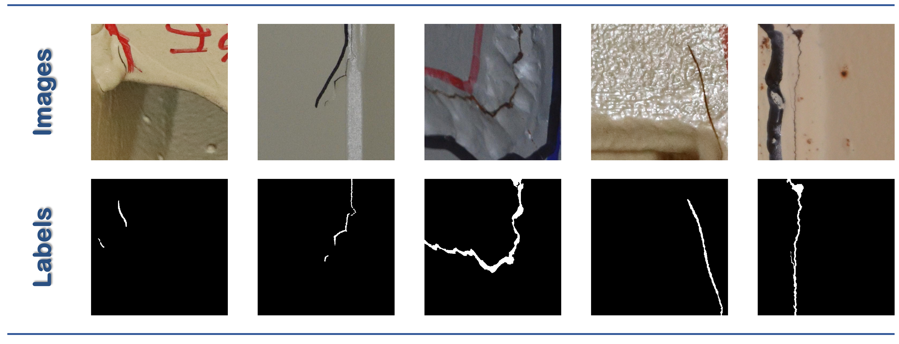

# Civil-dataset

## 📖 Introduction
This repository mainly includes 2 datasets. If you have any questions, please don't hesitate to contact us.
- [x] :apple: **Steelcrack Dataset**.
- [ ] :grapes: Crack dataset.

## 📢 News
- **2024.02.29**: We release Steelcrack dataset!

## 🌟 Steelcrack
### Download
**Download address**: [Google Drive](https://drive.google.com/file/d/1UWcv2b6sZ3jkKBrQJ6Mh6nNraEy7MIbc/view?usp=sharing) or [OneDrive](https://hkustconnect-my.sharepoint.com/:u:/g/personal/zhebg_connect_ust_hk/ETvldO5h0ZlKjfe-WgonKYwBmwf7vSK7v4zRqm8IEJC8dQ?e=mbX0PC).  
### Basic information
All the images in the Steelcrack are directly captured from **different projects of steel structures**.
| **Dataset**                                    | **Image size** | **Training set** | **Validation set** |**Test set** |
|----------------------------------------------|----------------|------------|------------|------------|
| **Steelcrack**                              | 512 × 512 | 3300 images  | 525 images | 530 images |

### Data source
Some of the images are from the 1st International Project Competition for SHM, while others are provided by us.  
**We re-label all the images to get more refined annotations**.

### Representative image samples
<div align="center">
  
</div>

### 🎖️ Experimental results on Steelcrack
| **Method**                 | **mi IoU (%)** | **mi Dice (%)** | **#Param. (M)** |**MACs (G)** |
|:---------------------------|:--------------:|:---------------:|:---------------:|:-----------:|
| **U-Net**                  | 68.49          | 75.13           | 7.77            | 55.01       |
| **U-Net++**                | 72.23          | 78.37           | 9.16            | 138.63      |
| **Attention U-Net**        | 71.25          | 77.54           | 34.88           | 266.54      |
| **CE-Net**                 | 76.00          | 81.54           | 29.00           | 35.60       |
| **DeepLabv3+ (MobileNetv2)** | 68.22        | 71.07           | 5.81            | 29.13       |
| **DeepLabv3+ (Xception)**    | 67.40        | 71.48           | 54.70           | 83.14       |
| **DeepLabv3+ (ResNet-101)**  | 69.04        | 69.45           | 59.34           | 88.84       |
| **SCRN**                   | 73.23          | 78.91           | 25.23           | 31.92       |
| **TransUNet**              | 64.34          | 72.55           | 67.87           | 129.96      |
| **CrackSeU-B**             | 70.42          | 80.50           | 3.19            | 11.22       |
| **CrackSeU-L**             | 71.66          | 81.24           | 4.62            | 28.22       |
| **DconnNet**               | 74.73          | 83.40           | 28.38           | 24.79       |
| **BGCrack V1**             | 77.16          | 85.33           | 2.32            | 15.76       |

## ✨ Other dataset
## 💞: Cite Civil-dataset
You are very welcome to use and cite our datasets! The BibTeX entry is as follows:
### Steelcrack Dataset
```
@article{HE2024BGCrack,
title = {Crack segmentation on steel structures using boundary guidance model},
journal = {Automation in Construction},
volume = {162},
pages = {105354},
year = {2024},
issn = {0926-5805},
doi = {https://doi.org/10.1016/j.autcon.2024.105354},
url = {https://www.sciencedirect.com/science/article/pii/S0926580524000906},
author = {Zhili He and Wang Chen and Jian Zhang and Yu-Hsing Wang},
keywords = {Crack inspection, Deep learning, Boundary guidance method, Benchmark dataset}
}
```
